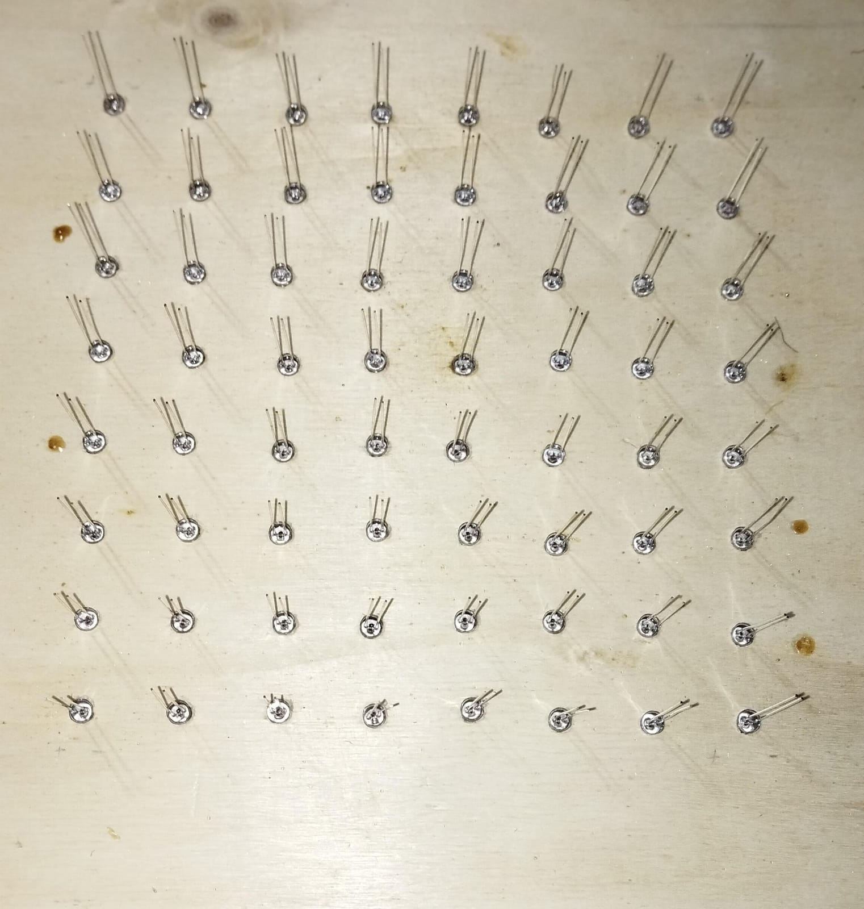
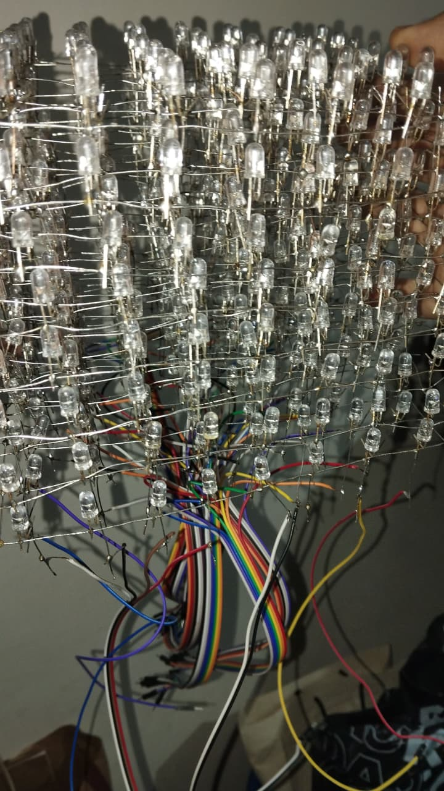
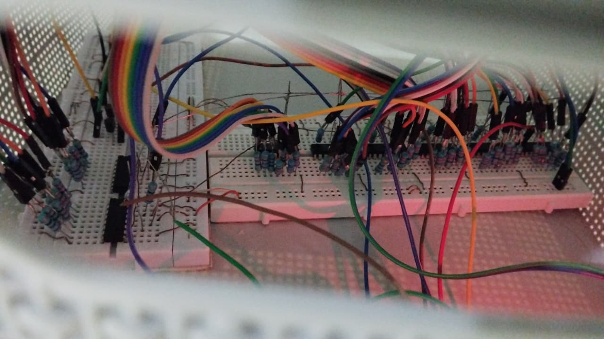
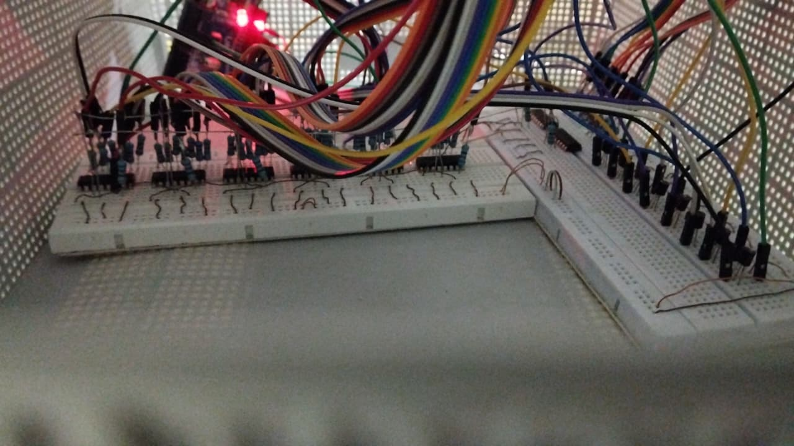
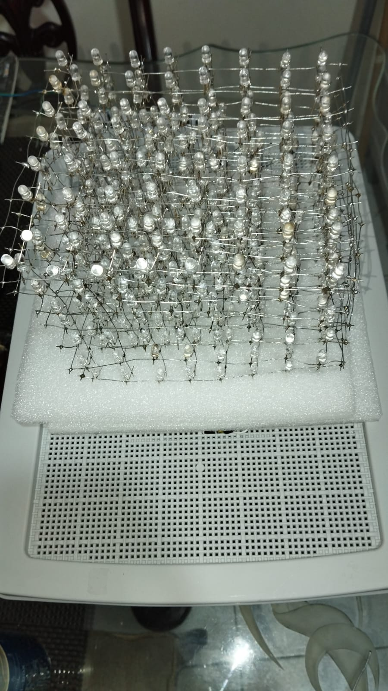

# Proceso de Construcción - Cubo LED 8x8x8

## 1. Preparación de la Malla 8x8

### Cortando los Cátodos

**Archivo:** `cortandoCatodos.mp4`

En esta etapa se preparan las mallas de 8x8 LEDs para cada capa del cubo. El proceso consiste en:

- Doblar los cátodos de los LEDs formando una cuadrícula de 8x8
- Soldar los cátodos entre sí para formar una malla conductora común
- Cortar los excesos de las patas para mantener la estructura plana y uniforme

**Herramientas utilizadas:**
- Cortador de precisión
- Cautín
- Estaño y flux

---

## 2. Posicionamiento en el Molde

**Archivo:** `posiciones.jpg`

Colocación precisa de los LEDs en el molde temporal de 8x8. Este molde garantiza que:

- Todos los LEDs estén perfectamente alineados y espaciados
- Las distancias entre LEDs sean uniformes
- La estructura mantenga perpendicularidad en los tres ejes

**Proceso:**
1. Insertar LEDs en el molde perforado
2. Verificar polaridad (ánodo largo, cátodo corto)
3. Ajustar altura de todos los LEDs al mismo nivel
4. Soldar la malla de cátodos

---

## 3. Cableado y Estructura

**Archivo:** `visualizacion.jpg`

Vista del cubo completamente ensamblado antes de montarlo en la base. Se pueden observar:

- Las 8 capas soldadas y conectadas verticalmente con cable UTP
- Los 64 cables de columnas descendiendo desde la base del cubo
- Los 8 cables de control de capas (uno por nivel)
- La estructura tridimensional completa manteniendo su forma

**Componentes visibles:**
- Cable UTP estañado como soporte vertical rígido
- Conexiones soldadas entre capas
- Organización de cables por código de colores del UTP

---

## 4. Testing Individual de LEDs

**Archivo:** `testing.mp4`

Fase crítica de verificación donde se prueba cada LED individualmente antes del montaje final. Este proceso permite:

- Identificar LEDs defectuosos o mal soldados
- Verificar continuidad en las conexiones de columnas y capas
- Detectar cortocircuitos o cruces de cables
- Confirmar la polaridad correcta de todos los LEDs

**Método de testing:**
- Activar una capa a la vez mediante los transistores
- Recorrer todas las columnas secuencialmente
- Verificar que cada posición (x, y, z) encienda el LED correcto

---

## Circuitos internos

### Vista Interna 1

### Vista Interna 2

**Archivos:** `interno1.jpg`, `interno2.jpg`

Detalle de los circuitos de control montados dentro de la base del cubo:

**Componentes visibles:**
- **8 registros 74HC595N** conectados en cascada para control de columnas (64 salidas totales)
- **8 transistores 2N2222** para conmutación de capas
- **Protoboards** con conexiones organizadas
- **Arduino UNO** como controlador principal
- Cableado organizado con código de colores

**Distribución:**
- Sección izquierda: Registros de desplazamiento en cascada
- Sección central: Arduino y alimentación
- Sección derecha: Transistores de control de capas

**Conexiones críticas aseguradas:**
- SRCLR de todos los 74HC595 → VCC
- OE de todos los 74HC595 → GND
- Cascada Q7' → SER entre registros

---

## 6. Montaje Final en la Base

**Archivo:** `base.jpg`

El cubo LED completamente ensamblado y montado en su base definitiva. Se observa:

- Estructura del cubo firmemente montada sobre la base
- Todos los cables organizados y ocultos dentro de la base
- Circuitería protegida y accesible para mantenimiento
- Disposición final lista para demostración

---

## 7. Demostración Final

**Archivo:** `final.mp4`

Video de demostración mostrando los patrones funcionando en el evento de Corposucre:

---

**Proyecto desarrollado con 💙 para representar a la Universidad de Sucre en Corposucre**
